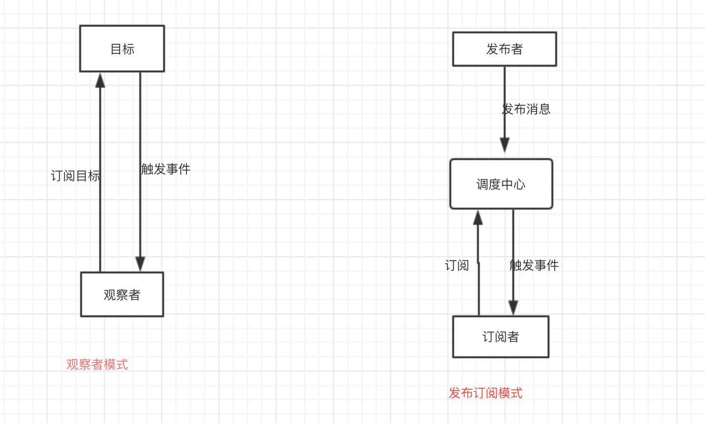
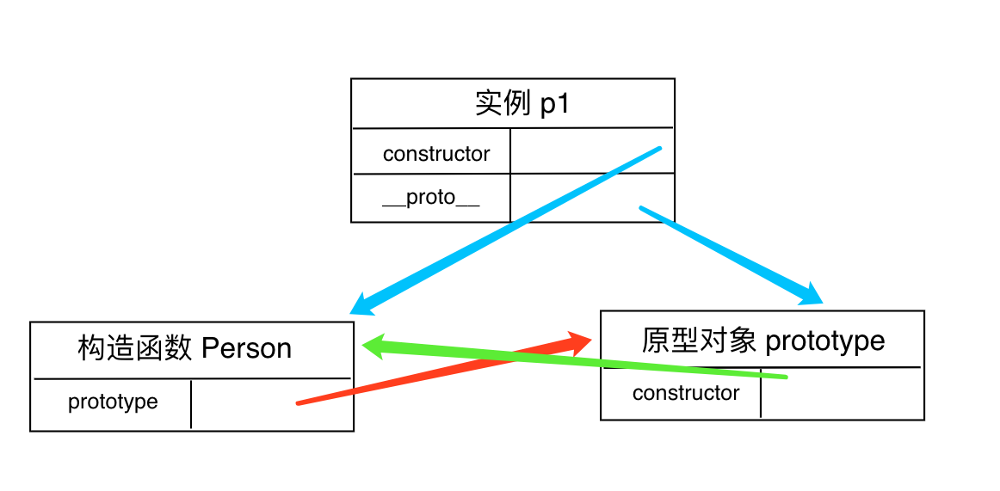

## 观察者模式、发布订阅模式


观察者模式由具体目标调度，每个被订阅的目标里面都需要有对观察者的处理，会造成代码的冗余  
发布订阅模式则统一由调度中心处理，消除了发布者和订阅者之间的依赖  

## `new`命令的原理
使用`new`命令时，它后面的函数依次执行下面的步骤:  
1. 创建一个空对象，作为将要返回的对象实例。
2. 将这个空对象的原型，指向构造函数的prototype属性。
3. 将这个空对象赋值给函数内部的this关键字。
4. 开始执行构造函数内部的代码。

也就是说，构造函数内部，this指的是一个新生成的空对象，所有针对this的操作，都会发生在这个空对象上。构造函数之所以叫“构造函数”，就是说这个函数的目的，就是操作一个空对象（即this对象），将其“构造”为需要的样子。

## 柯里化
函数的柯里化，是 Javascript 中函数式编程的一个重要概念。它返回的，是一个函数的函数。其实现方式，需要依赖参数以及递归，通过拆分参数的方式，来调用一个多参数的函数方法，以达到减少代码冗余，增加可读性的目的。
```javascript
function sum (x) {
    if (arguments.length == 2) {
        return arguments[0] + arguments[1];
    }
    
    return function(y) {
        return x + y;
    }
}
sum(2)(3)
```
## 进程和线程 (https://juejin.im/post/5a6547d0f265da3e283a1df7)
程序是我们写的代码，需要对应到一个具体的进程来运行，进程间有独立的内存地址，互不干扰。  
线程是进程的子任务，属于同一进程的线程共享相同的内存。  
进程让程序之间的并发成为了可能，线程让进程内的子任务并发成为了可能。

## 模块
- CommonJS(node | require / module.exports / exports)：同步
- AMD： 异步，依赖前置，js可以方便知道依赖模块是谁，立即加载
- CMD： 异步，依赖就近，用的时候再require

CommonJS和ES6中模块化的两者区别  
1. 前者支持动态导入，也就是 require(${path}/xx.js)，后者目前不支持，但是已有提案
2. 前者是同步导入，因为用于服务端，文件都在本地，同步导入即使卡住主线程影响也不大。而后者是异步导入，因为用于浏览器，需要下载文件，如果也采用同步导入会对渲染有很大影响
3. 前者在导出时都是值拷贝，就算导出的值变了，导入的值也不会改变，所以如果想更新值，必须重新导入一次。但是后者采用实时绑定的方式，导入导出的值都指向同一个内存地址，所以导入值会跟随导出值变化
4. 后者会编译成 require/exports 来执行的

## 递归
给定一个无序不重复数组，找出3个数，它们的和为目标数
```javascript
var arr = [2, 3, 1, 5, 7, 8, 8, 4, 10, 15]
var target = 9

var combinationSum2 = function(arr, target) {
	const buffer = [];
	const result = [];

    const backTrace = (index, target) => {
        if(target === 0) {
            return result.push(buffer.slice());
        }

        if(target < 0) {
            return;
        }

        if(index === arr.length) {
          return;
        }

        buffer.push(arr[index]);//暂时保存当前数字
        backTrace(index + 1, target - arr[index]);
        buffer.pop();//删除保存的数组，下一步重新开始

        backTrace(index + 1, target);
    }
    backTrace(0, target);

    return result.filter(item => item.length === 3)
};

console.log(combinationSum2(arr, target))
```

## 排序
### 冒泡排序
```javascript
function maoPao(arr) {
  const len = arr.length
  for(let i = 0; i < len - 1; i++){
    for(let j = 1; j < len; j++){
      if (arr[j - 1] > arr[j]){
        let k = arr[j - 1]
        arr[j - 1] = arr[j]
        arr[j] = k
      }
    }
  }
  return arr
}
```
### 插入排序
```javascript
function chaRu(arr) {
  const len = arr.length
  for(let i = 1; i < len; i++){
    for (let j = i; j > 0; j--){
      if (arr[j - 1] > arr[j]){
        let k = arr[j - 1]
        arr[j - 1] = arr[j]
        arr[j] = k
      }
    }
  }
  return arr
}
```
### 选择排序
```javascript
function xuanZhe(arr) {
  const len = arr.length
  for(let i = 0; i < len - 1; i++){
    for(let j = i; j < len; j++){
      if (arr[i] > arr[j]){
        let k = arr[i]
        arr[i] = arr[j]
        arr[j] = k
      }
    }
  }
  return arr
}
```
### 快速排序
```javascript
function kuaiSu(arr) {
  if (arr.length < 2) {
    return arr
  }
  let leftArr = []
  let rightArr = []
  let theNumIndex = Math.floor(arr.length/2)
  let theNum = arr.splice(theNumIndex - 1, 1)
  arr.forEach((v) => {
    if (v <= theNum) {
      leftArr.push(v)
    } else {
      rightArr.push(v)
    }
  })
  return kuaiSu(leftArr).concat(theNum, kuaiSu(rightArr))
}
```

### 大O符号

大O符号中指定的算法的增长顺序。

以下是一些最常用的 大O标记法 列表以及它们与不同大小输入数据的性能比较。

| 大O标记法      | 计算10个元素                 | 计算100个元素                 | 计算1000个元素                  |
| -------------- | ---------------------------- | ----------------------------- | ------------------------------- |
| **O(1)**       | 1                            | 1                             | 1                               |
| **O(log N)**   | 3                            | 6                             | 9                               |
| **O(N)**       | 10                           | 100                           | 1000                            |
| **O(N log N)** | 30                           | 600                           | 9000                            |
| **O(N^2)**     | 100                          | 10000                         | 1000000                         |
| **O(2^N)**     | 1024                         | 1.26e+29                      | 1.07e+301                       |
| **O(N!)**      | 3628800                      | 9.3e+157                      | 4.02e+2567                      |

### 数据结构操作的复杂性

| 数据结构       |  连接  |  查找  |  插入  |  删除  | 备注 |
| -------------- | :----: | :----: | :----: | :----: | ---- |
| **数组**       |   1    |   n    |   n    |   n    |      |
| **栈**         |   n    |   n    |   1    |   1    |      |
| **队列**       |   n    |   n    |   1    |   1    |      |
| **链表**       |   n    |   n    |   1    |   1    |      |
| **哈希表**     |   -    |   n    |   n    |   n    | 在完全哈希函数情况下，复杂度是 O(1） |
| **二分查找树** |   n    |   n    |   n    |   n    | 在平衡树情况下，复杂度是 O(log(n)) |
| **B 树**       | log(n) | log(n) | log(n) | log(n) |      |
| **红黑树**     | log(n) | log(n) | log(n) | log(n) |      |
| **AVL 树**     | log(n) | log(n) | log(n) | log(n) |      |
| **布隆过滤器** |   -    |   1    |   1    | - | 存在一定概率的判断错误（误判成存在） |

### 数组排序算法的复杂性

| 名称                  | 最优      | 平均      | 最坏          | 内存      | 稳定      | 备注                  |
| --------------------- | :-------: | :-------: | :-----------: | :-------: | :-------: | --------------------- |
| **冒泡排序**          | n         | n^2       | n^2           | 1         | Yes       |                       |
| **插入排序**          | n         | n^2       | n^2           | 1         | Yes       |                       |
| **选择排序**          | n^2       | n^2       | n^2           | 1         | No        |                       |
| **堆排序**            | n log(n)  | n log(n)  | n log(n)      | 1         | No        |                       |
| **归并排序**          | n log(n)  | n log(n)  | n log(n)      | n         | Yes       |                       |
| **快速排序**          | n log(n)  | n log(n)  | n^2           | log(n)    | No        | 在 in-place 版本下，内存复杂度通常是 O(log(n)) |
| **希尔排序**          | n log(n)  | 取决于差距序列   | n (log(n))^2  | 1         | No        |  |
| **计数排序**          | n + r     | n + r     | n + r         | n + r     | Yes       | r - 数组里最大的数    |
| **基数排序**          | n * k     | n * k     | n * k         | n + k     | Yes       | k - 最长 key 的升序   |

## 原型继承
```javascript
function Animal(name) {
  this.name = name;
}

Animal.prototype.setName = function(name) {
  this.name = name;
};
Animal.prototype.getName = function(name) {
  return this.name;
};

function Dog(name, breed) {
  Animal.call(this, name);
  this.breed = breed;
}

Dog.prototype = Object.create(Animal.prototype);

// 因为上面的语句将我们原来的prototype的指向修改了，所以我们要重新定义Dog的prototype属性的constructor属性
Reflect.defineProperty(Dog.prototype, "constructor", {
  value: Dog,
  enumerable: false, // 不可枚举
  writable: true
});

const animal = new Animal("potato");
console.log(animal.__proto__ === Animal.prototype); // true
console.log(animal.constructor === Animal); // true
console.log(animal.name); // potato

const dog = new Dog("potato", "labrador");
console.log(dog.name); // potato
console.log(dog.breed); // labrador
console.log(dog.__proto__ === Dog.prototype); // true
console.log(dog.constructor === Dog); // true
```

## call、apply、bind()
`apply`、`call`、`bind`三者都是用来改变函数的this对象的指向的  
`apply`、`call`、`bind`三者第一个参数都是this要指向的对象，也就是想指定的上下文  
`apply`、`call`、`bind`三者都可以利用后续参数传参  
`bind`是返回对应函数，便于稍后调用；`apply`、`call`则是立即调用

## 判断对象相等
用JSON.stringify()

## 构造函数、原型对象和实例的关系

```javascript
// 证明 p1是 Person 的实例
p1.constructor === Person // true
p1 instanceof Person // true

// 证明 Person.prototype 是 p1 的原型对象
Person.prototype === p1.__proto__ // true
Person.prototype.isPrototypeOf(p1) // true
Object.getPrototypeOf(p1) === Person.prototype // true
```

## requestAnimationFrame实现回到顶部 (from`https://cuixote.gitee.io/`)
```javascript
// 匀速返回顶部
function backToTop(interval = 500, element) {
  // 当前元素
  const ele = element || document.body || document.documentElement;
  // 获取当前时间
  const getTime = () =>
    (performance && performance.now && performance.now()) || Date.now();
  // 获取当前时间
  const startTime = getTime();
  // 获取当前页面的滚动高度
  const scrollTop = ele.scrollTop;
  // 回调函数
  const callback = function() {
    // 已经过去了多久
    const cost = getTime() - startTime;
    // 通过已经过去的时间类比已滚动的高度
    const currentScrollTop =
      (Math.max(0, interval - cost) / interval) * scrollTop;
    // 设置当前高度
    ele.scrollTop = currentScrollTop;
    // 如果没有到达顶部，下次重绘继续调用
    currentScrollTop && requestAnimationFrame(callback);
  };
  // 如果没有到达顶部，下次重绘继续调用
  scrollTop && requestAnimationFrame(callback);
}
```
问：为什么我们不直接用(scrollTop/500) * 1/60作为每次调用requestAnimationFrame移动的距离？  
答：毕竟每次调用requestAnimationFrame的时间间隔不一定等于1/60，还是计算一下距离上次调用过去了多少时间更为准确，而使用performance.now()会比Date.now()更加精确一点。  
**公告系统 => setInterval => requestAnimationFrame => 递归 => 尾递归优化 => 验证堆栈溢出**

## 双向绑定
```html
<!doctype html>
<html lang="en">
<head>
  <meta charset="UTF-8">
  <title>双向绑定</title>
</head>
<body>
<input id="a">
<p id="b"></p>
</body>
</html>
<script>
	var $a = document.getElementById("a");
	var $b = document.getElementById("b");
	var obj = {};

	Object.defineProperty(obj, "content", {
		get: function() {
			//console.log('get...')
		},
		set: function(val) {
			$b.textContent = val;
			//console.log('set...')
		}
	});

	$a.addEventListener("input", function() {
		obj.content = this.value;
	});

	// init
	$a.value = $b.textContent = obj.content = "123";
</script>
```

## 函数节流
```javascript
function throttle(fn, interval) {
    var _self = fn // 保存需要被延迟执行的函数引用
    var firstTime = true // 是否初次调用
    var timer // 定时器

    return function () {
        var args = arguments
        var _me = this
        if (firstTime) {      // 如果是第一次调用不需要延迟执行
            _self.call(_me, args)
        }
        if (timer) {      // 如果定时器还在，说明前一次延迟执行还没有完成
            return false
        }

        timer = setTimeout(function () {      // 延迟一段时间执行
            clearTimeout(timer) // 清除定时器 避免下一次return false
            timer = null
            _self.call(_me, args)
        }, interval || 500)
    }
}

function resizeDiv() {
    var div = document.getElementById('mydiv')
    div.style.height = div.offsetWidth + 'px'
    console.log('resize')
}

window.onresize = throttle(resizeDiv)
```

## 函数防抖
```javascript
function debounce(fn) {
    var timer
    var _self = fn
    return function () {
        clearTimeout(timer)
        var args = arguments // fn所需要的参数
        var _me = this // 当前的this
        timer = setTimeout(function () {
            _self.call(_me, args)
        }, 200)
    }
}

function resizeDiv() {
    var div = document.getElementById('mydiv')
    div.style.height = div.offsetWidth + 'px'
    console.log('resize')
}

window.onresize = debounce(resizeDiv)
```

## this指向
如果要判断一个运行中函数的 this 绑定，就需要找到这个函数的直接调用位置，找到之后就可以顺序应用下面这四条规则来判断 this 的绑定对象  
- `new`调用：绑定到新创建的对象，注意：显示return函数或对象，返回值不是新创建的对象，而是显式返回的函数或对象。
- `call`或者`apply`（或者`bind`）调用：严格模式下，绑定到指定的第一个参数。非严格模式下，null和undefined，指向全局对象（浏览器中是window），其余值指向被new Object()包装的对象。
- 对象上的函数调用：绑定到那个对象。
- 普通函数调用：在严格模式下绑定到 undefined，否则绑定到全局对象。

## target和currentTarget的区别
event.currentTarget是绑定事件的元素，而event.target是当前触发事件的元素。比如常见的事件委托中的ul和li。

## 跳出循环
- for循环: `break`终止循环，`continue`跳出循环，执行下次循环
- Array forEach(): 不能终止跳出循环，除非捕获错误，要想实现`forEach()`相关功能，可使用every()、some()代替
- Array every(): `return true`跳出循环，`return false`终止循环，`some()`类似

## 确定原型和实例的关系
- instanceof操作符测试实例和原型链中出现过的构造参数
`person1  instanceof  Person;//true`
- isPrototypeOf()方法，只要是原型链中出现的原型，都可以说是该链所派生的实例的原型
`Person.prototype.isPrototypeOf(person1);//true`
- hasOwnProperty()方法，可以检测一个属性是存在于实例中，还是原型中
`person1.hasOwnProperty(“name”);实例true，原型false`
in操作符，会在通过对象能够访问给定属性时返回true，无论存在于实例还是原型中
`'name' in person1;`
for-in循环返回所有能够通过对象访问的，可枚举的属性，包括实例和原型中的属性

## Object.prototype.toString.call(obj)
```javascript
Object.prototype.toString.call(123) //[object Number]
Object.prototype.toString.call('asd') //[object String]
Object.prototype.toString.call(undefined) //[object Undefined]
Object.prototype.toString.call(true) //[object Boolean]
Object.prototype.toString.call({}) //[object Object]
Object.prototype.toString.call([]) //[object Array]
Object.prototype.toString.call(function(){}) //[object Function]
```

## typeof检测基本类型
number | string | boolean | null（object） | undefined | function（function）

## 引用类型
Object、Array、Date、RegExp、Function、基本包装类型（Boolean、Number、String）、单体内置对象（Global、Math）

## 异步执行
- microtasks: process.nextTick、 Promises、 Object.observe、 MutationObserver
- macrotasks: script(整体代码)、 setTimeout、 setInterval、 setImmediate、 I/O、 UI rendering

执行顺序:  
script(主程序代码)—>process.nextTick—>Promises...——>setTimeout——>setInterval——>setImmediate——> I/O——>UI rendering


## offset、scroll、client
### offset
#### offsetLeft和offsetTop
offsetLeft和offsetTop用来获得对象的位置，到距离自身最近的（带有定位的）父元素的距离，若没有则以body为准
##### offsetLeft和style.left的区别
1. style.left只能获取行内样式，offsetLeft可以获取行内样式和内嵌样式
2. style.left可读可写，offsetLeft是只读属性
3. style.left是字符串并且带单位px，offsetLeft是数值，
4. 如果没有加定位，style.left获取的数值可能是无效的
5. 最大区别在于style.left以margin左上角为基准，offsetLeft以border左上角为基准
#### offsetWidth和offsetHeight
offsetWidth和offsetHeight包括content、padding、border
##### offsetHeight和style.height的区别
1. style.height只能获取行内样式，offsetHeight可以获取行内样式和内嵌样式
2. style.height是字符串并且带单位px，offsetHeight是数值
3. style.height可读可写，offsetHeight是只读属性

### scroll
#### scrollLeft和scrollTop
scrollLeft和scrollTop显示内容区到整个内容区的距离
#### scrollHeight和scrollWidth
scrollHeight和scrollWidth指的是实际内容的高度、宽度，包括content和padding，不包括border

### client
#### clientWidth和clientHeight
clientWidth和clientHeight包括content和padding，不包括border

